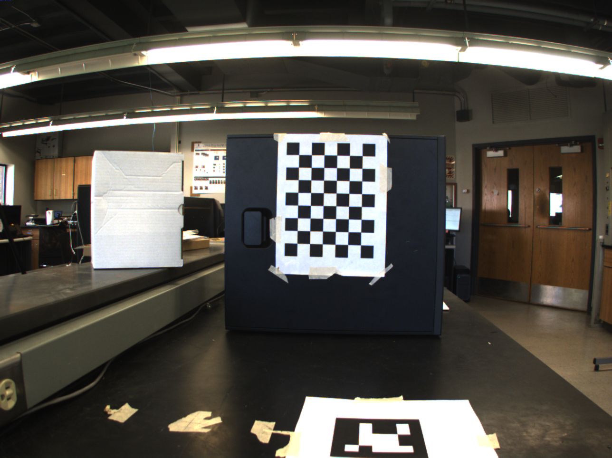
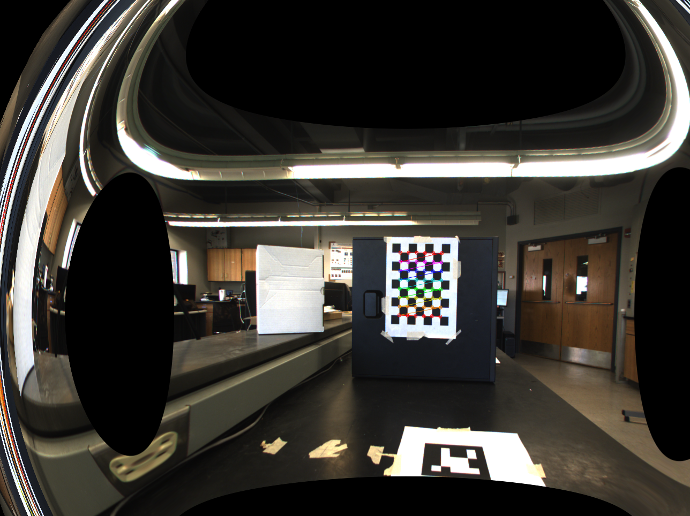
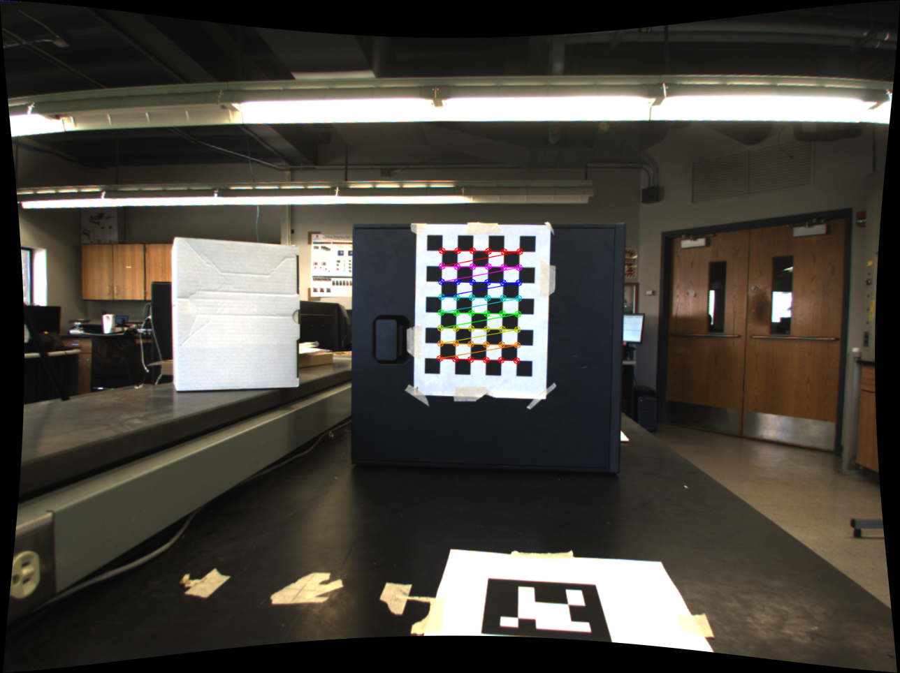
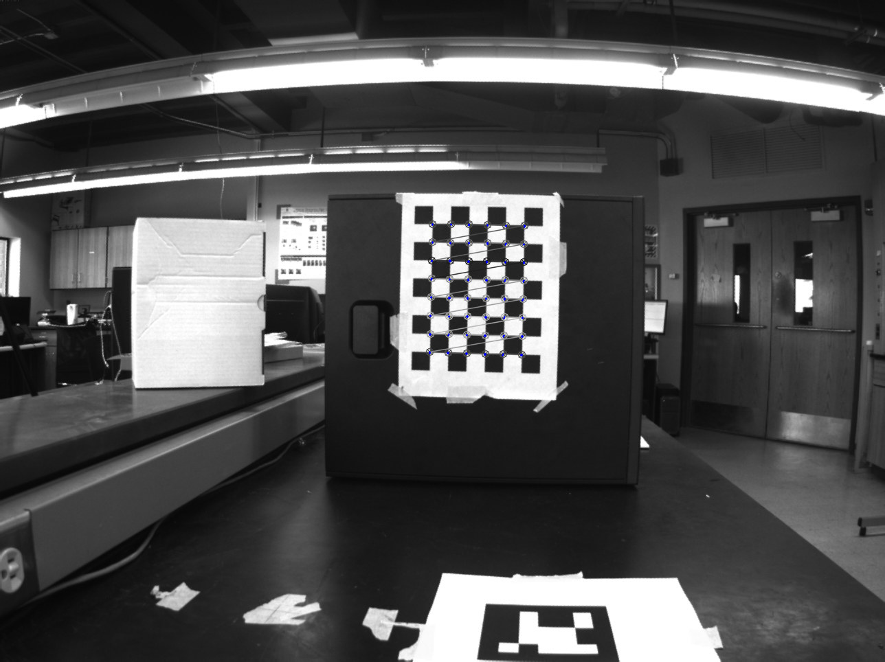
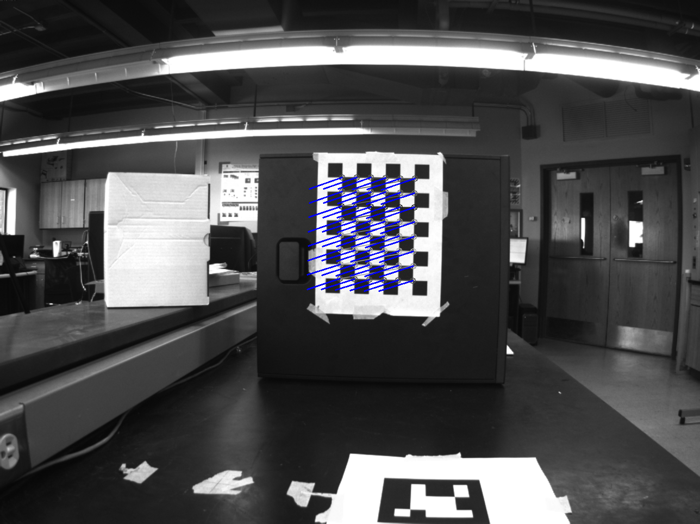

# RWHEC-exp-2019

Comments/Bugs/Problems: amy.tabb@usda.gov

Methods for robot-world, hand-eye calibration; version 2.1.

~July 2019: This code is an experimental version of [amy-tabb/RWHEC-Tabb-AhmadYousef](https://github.com/amy-tabb/RWHEC-Tabb-AhmadYousef). 

### Differences

There are several new features that may make their way to [amy-tabb/RWHEC-Tabb-AhmadYousef](https://github.com/amy-tabb/RWHEC-Tabb-AhmadYousef) ... eventually.
	
1. Calling the program using more standard flags (via getopt.h) versus a sort of convoluted argument structure.
1. Options to customize the camera calibration portion (more details below [Camera calibration parameters](#camera-calibration-parameters)); briefly, otherwise, one gets a not-very-useful calibration for limited camera views during debugging.
2. Options to convert matrices where the robot pose is provided with **R** and the end-effector position **C**, as is commonly provided by many robot controllers.  To convert to HTMs is not difficult, and I will describe this process ([Robot pose parameters](#robot-pose-parameters))and it is also implemented in the code such that the HTMs for the robot are   

````
[  R    t   ]
[ 0 0 0  1  ]
````

# Underlying ideas; how and when to cite this work

This README file is to accompany code for robot-world, hand-eye calibration, produced by Amy Tabb as companion to a paper:
	Solving the Robot-World Hand-Eye(s) Calibration Problem with Iterative Methods

````latex
@Article{tabb_solving_2017,
author="Tabb, Amy
and Ahmad Yousef, Khalil M.",
title="Solving the robot-world hand-eye(s) calibration problem with iterative methods",
journal="Machine Vision and Applications",
year="2017",
month="Aug",
day="01",
volume="28",
number="5",
pages="569--590",
issn="1432-1769",
doi="10.1007/s00138-017-0841-7",
url="https://doi.org/10.1007/s00138-017-0841-7"
}
````

Dataset and/or code:

````latex
@misc{tabb_data_2017,
	title = {Data from: {Solving} the {Robot}-{World} {Hand}-{Eye}(s) {Calibration} {Problem} with {Iterative} {Methods}},
	shorttitle = {Data from},
	url = {https://data.nal.usda.gov/dataset/data-solving-robot-world-hand-eyes-calibration-problem-iterative-methods_3501},
	language = {en},
	urldate = {2019-03-12},
	publisher = {Ag Data Commons},
	author = {Tabb, Amy},
	year = {2017},
	doi = {10.15482/USDA.ADC/1340592},
	note = {type: dataset}
}
````


If you use this code in project that results in a publication, please cite at a minimum the paper above.  Otherwise, there are no restrictions in your use of this code.  However, no guarantees are expressed or implied.

# Building

Please see [amy-tabb/RWHEC-Tabb-AhmadYousef](https://github.com/amy-tabb/RWHEC-Tabb-AhmadYousef) for building instructions -- they will be identical.

# Running

1. The executable using the method above is going to be in the `build` folder.  The arguments for the program are found by running the program with the `--help` flag.

Here's the current listing (subject to change):

```
--input=[STRING]                          Mandatory, has to be a directory.
--output=[STRING]                         Mandatory, has to be a directory.
--focal-px=[float]                        Initial focal length in pixels for the camera.  Default is max dimension * 1.2 
--camera-only                             No arguments. Indicates you only want to calibrate the camera(s)
--rwhec-only                              No arguments. Indicates you only want to perform the robot-camera calibration, cameras are already calibrated and the calibration is stored in the write directory (check).
 To calibrate cameras and robot-camera, do not list either flag.
--htms-need-trans                         No arguments.  Indicates that the robot HTMs are R | C instead of R | t. The code will transform and write the correct file.  NOTE: X, Z assume R | t, this is a transition feature and will be removed.
--zero-tangent                            No arguments. In the camera calibration part, sets the tangential components of radial distortion (p1, p2) to zero.
--zero-k3                                 No arguments. In the camera calibration part, sets the 3rd radial distortion k value to zero.
```

Brief explanations: 
- you need to provide an input directory, this is where all of your data is.  [Input format](#input-format) describes how to format this data.
- you need to provide an output directory, where the results will be written.
- you may select to only compute the camera calibration parameters, if so, trigger this by selecting the `--camera-only` flag.
- Assuming that the camera calibration parameters have been computed *and reside in the output directory*, you may select to only compute the robot-world, hand-eye calibration with those pre-computed camera calibration parameters.  Do so via the `--rwhec-only`.  
- if you want to compute everything, don't use either  `--camera-only`  or the `--rwhec-only` flag -- this is my recommendation.
- to indicate the likely focal length in pixels to initialize the camera calibration, do so via `--focal-px=[float]`. (This is the value of the top left entry of the intrinsic camera calibration matrix.)
- during camera calibration, to indicate that the tangential components of radial distortion (p1, p2) are zero use flag `--zero-tangent`.  This is needed sometimes, examples are in [Camera calibration parameters](#camera-calibration-parameters).
- similarly, during camera calibration, to indicate that the 3rd radial distortion k value is zero, use flag `--zero-k3`.  It is likely that one would use `--zero-tangent` and `--zero-k3` together.  Again -- more discussion in [Camera calibration parameters](#camera-calibration-parameters).
- if the robot poses are provided with **C** instead of **t**, the program will transform the matrices and write the new HTMs if flag `--htms-need-trans` is used.  Note that the resulting **X** and **Z** matrices as a result of the calibration assume that **t** is provided as expected, so take a look at the code to get this sorted out in your input. More details in [Robot pose parameters](#robot-pose-parameters).


Instructions for the input format can be found at [Input format](#input-format).

Run time:
It will take some time (on the order of 4 minutes) to perform camera calibration, and then to perform all of the robot-world, hand-eye calibration methods (4 minutes more), though this varies by dataset, image size, and processor speed. 

# Input format

INPUT FORMAT -- test datasets are posted at the (U.S.) National Agriculture Library's Ag Data Commons, DOI is [10.15482/USDA.ADC/1340592](http://dx.doi.org/10.15482/USDA.ADC/1340592).

## Required Directories:

1. `images`

2. `internal_images` (not required now -- optional)

Each of these directories, should contain directories by camera with images.  For instance, for one camera, the `images` directory should contain `camera0`.  For two cameras, it should contain `camera0` and `camera1`. Use the provided datasets as templates for how to set up your own datasets.

The `images` directory represents the images for each stop of the robot.  `internal_images` contains extra images that are used for camera calibration only.  The directory structure of `camera0`, `camera1`, etc. within `internal_images` should be used, if `internal_images` is present.

## Required files:
1. `calibration_object.txt` : This file gives the specification of the calibration pattern.  The units can be changed, however at this time the particular strings used are 'chess_mm_height', 'chess_mm_width' by the program. Make sure that if you are not using millimeters, that you are aware of which units you are using!

	Example from dataset 1:

```
	chess_mm_height 28.5

	chess_mm_width 28.5

	chess_height 6

	chess_width 8
```

2. `robot_cali.txt` : This file gives the number of robot positions, as well as the rotation and translation parameters for the robot.  In the notation of our paper, these matrices are B_i.  Note that our definition is the inverse of some other works.  

3. Optional Included file:
`ExperimentDetails.txt` : This file gives some parameters of the experiments for the provided datasets and is not required to run the code.


# Output format

Please see [amy-tabb/RWHEC-Tabb-AhmadYousef](https://github.com/amy-tabb/RWHEC-Tabb-AhmadYousef) for the "Output format" section -- it will be identical, except for some extra debugging files written.

# Troubleshooting

If you're getting started with calibrating your robot arm, here are some notes about how to figure out some common problems and hopefully, get your system calibrated faster, whether or not you use this code.  All the methods I am aware of will assume that your robot pose follows a certain convention, and poor camera calibration quality can also affect results.

First of all, get a dataset with a small number of robot positions, and use the flags in [Camera calibration parameters](#camera-calibration-parameters).  Not only will the code run faster, it will be easier to see where there are issues. 

## Robot pose parameters

Many robot controllers provide the robot's pose in the form of some rotation parameters, as well as the end-effector's position.  I'll assume that you are able to convert the rotation parameters into a DCM (directed cosine matrix) **R**, which is a 3x3 orthogonal matrix.  The end-effector position (3x1 vector) is analogous to **C** in the camera-calibration literature.  IT IS NOT **t**.  The matrix you want for the robot pose is:

````
[  R    t   ]
[ 0 0 0  1  ]
````

Converting **R** and **C** to get **t** is straightforward:

````C++
t = -R*C;
````

That's it.  Note that if you use a method that is not mine, things to watch out for are the directions of the transformations.  In the paper above -- [link to non-paywalled version](https://www.researchgate.net/publication/316625160_Solving_the_robot-world_hand-eyes_calibration_problem_with_iterative_methods) -- we defined the transformations slightly differently such that computing the reprojection error was more straightforward.  

If you have your matrices set up in this way, with **C** instead of **t**:

````
[  R    C   ]
[ 0 0 0  1  ]
````

select the flag `--htms-need-trans` and the program will do the conversion for you, and write a file of these transformations.  Note that the calibration information -- **X** and **Z** assume that **t** is used, so you'll want to send **t** in your future projects when using the calibration information. 

*Note that there may still be some preprocessing needed to get your robot output into a form such that it represents the correct transformation.  This is one transformation, depending on your robot, you may need another one.*

## Camera calibration parameters

Three arguments have to deal with camera calibration parameters:

````bash
--focal-px=[float]                        Initial focal length in pixels for the camera.  Default is max dimension * 1.2 
--zero-tangent                            No arguments. In the camera calibration part, sets the tangential components of radial distortion (p1, p2) to zero.
--zero-k3                                 No arguments. In the camera calibration part, sets the 3rd radial distortion k value to zero.
````
First, if the focal length in pixels is known, this can be used to initialize the optimization of camera calibration parameters.  In the internal camera calibration matrix, this is the entry in the first row, first column.

Sometimes when the number of poses does not provide enough variety -- or the minimization finds a local minima that has a lower reprojection error -- the distortion coefficient estimation will not be desirable.  I will provide some examples.

First, the raw image:

  

Then, the camera is calibrated without using any flags.  In this particular example, it did not work out well.  You can tell by going to the output directory->camera_results0, and have a look at the undistorted images.  

Here's the result:



Pretty bad!  This is not what we want -- radial distortion correction should take straight lines in the physical world, and map them to straight lines in the image plane.  To get around this, set 

`--zero-tangent --zero-k3` (some experimentation may be necessary) and in this case, 



You are of course free to modify the Calibration2.cpp file for your particular camera calibration needs.

## Interpretation of results, quick version

The paper -- again, [non-paywalled link](https://www.researchgate.net/publication/316625160_Solving_the_robot-world_hand-eyes_calibration_problem_with_iterative_methods) -- concerned evaluating lots of choices when it came to robot-world, hand-eye camera calibration, in terms of parameterizations and cost function. *Because of this, not all of the methods will have a good result -- especially the seperable methods*.  This was one of the points of the paper.  To be quick, use a simulataneous method, gold standard would be to use a RPI method.   

The below image shows a distorted image, with the overlaid difference between the calibration pattern and reprojected points (as computed by the calibration) in blue, using the Euler-c1-simulaneous method.  You want to see a small amount of blue.



For the same dataset, with the Euler-c1-seperable method, this is the reprojected image.  There is a large reprojection error, and lots of blue.  Don't use the results from this method as your calibration!




